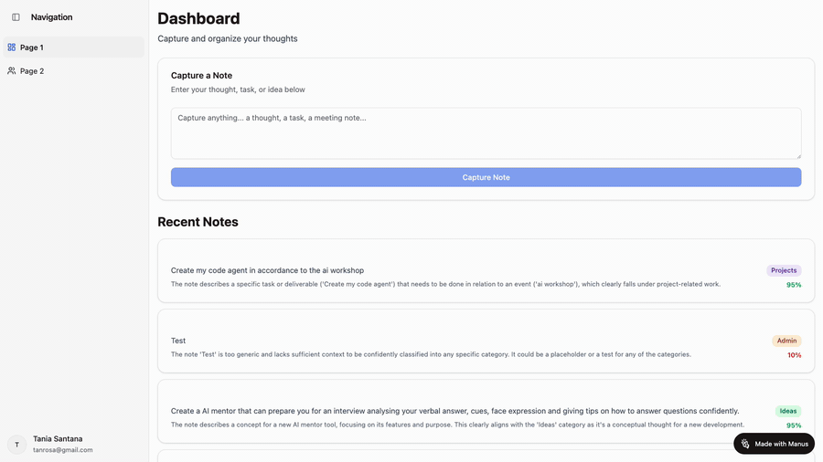

# Lychee - Intelligent Note Capture

Lychee is a smart note-taking application designed to automatically organize your thoughts. Using AI, it classifies your notes into categories like People, Projects, Ideas, and Admin, helping you stay organized effortlessly. Notes with lower classification confidence are added to a review queue for your manual approval.



## Features

-   **AI-Powered Classification**: Automatically categorizes notes with reasoning and a confidence score.
-   **Review Queue**: Manually review and correct classifications the AI is unsure about.
-   **Dashboard**: View your most recent notes at a glance.
-   **Category Views**: Filter and see all notes belonging to a specific category.
-   **Modern Tech Stack**: Built with React, TypeScript, tRPC, and Drizzle for a robust and type-safe experience.

## Tech Stack

-   **Frontend**: React, Vite, TypeScript, Tailwind CSS, shadcn/ui
-   **Backend**: Node.js, Express
-   **API**: tRPC
-   **Database**: Drizzle ORM (MySQL compatible)
-   **Authentication**: Manus OAuth

## Getting Started

### Prerequisites

-   [Node.js](https://nodejs.org/) (v18 or higher)
-   [pnpm](https://pnpm.io/installation)
-   A running MySQL-compatible database (e.g., MySQL, MariaDB, PlanetScale).

## Installation & Setup

1.  **Clone the repository**
    ```bash
    # If you haven't cloned it yet
    git clone <repository_url>
    cd lychee-app
    ```

2.  **Install dependencies**
    ```bash
    pnpm install
    ```

3.  **Set up environment variables**

    Copy the example environment file:
    ```bash
    cp .env.example .env
    ```
    Now, open the `.env` file and fill in the placeholder values:
    -   `VITE_APP_ID`, `OWNER_OPEN_ID`, `BUILT_IN_FORGE_API_KEY`: Obtain these from your Manus developer account.
    -   `JWT_SECRET`: Generate a long, random string for securing sessions.
    -   `DATABASE_URL`: Your database connection string.

4.  **Set up the database**

    Make sure your database server is running and the `DATABASE_URL` in your `.env` file is correct. Then, run the following command to apply the database migrations:

    ```bash
    pnpm db:push
    ```
    This will create the necessary tables (`users`, `notes`, `feedbackLogs`) in your database.

## Running the Application

Once the setup is complete, you can start the development server:

```bash
pnpm dev
```

The application will be available at `http://localhost:3000` (or the next available port if 3000 is busy). The server supports hot-reloading for both the frontend and backend.

## Available Scripts

-   `pnpm dev`: Starts the development server for both frontend and backend.
-   `pnpm build`: Builds the application for production.
-   `pnpm start`: Starts the production server (after running `build`).
-   `pnpm test`: Runs the backend unit tests using Vitest.
-   `pnpm db:push`: Applies database migrations.
-   `pnpm format`: Formats the code using Prettier.
-   `pnpm check`: Runs the TypeScript compiler to check for type errors.
